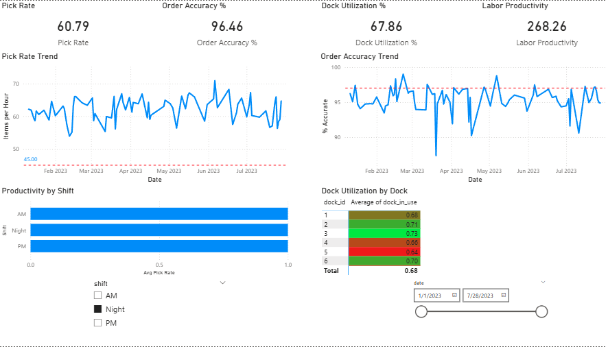
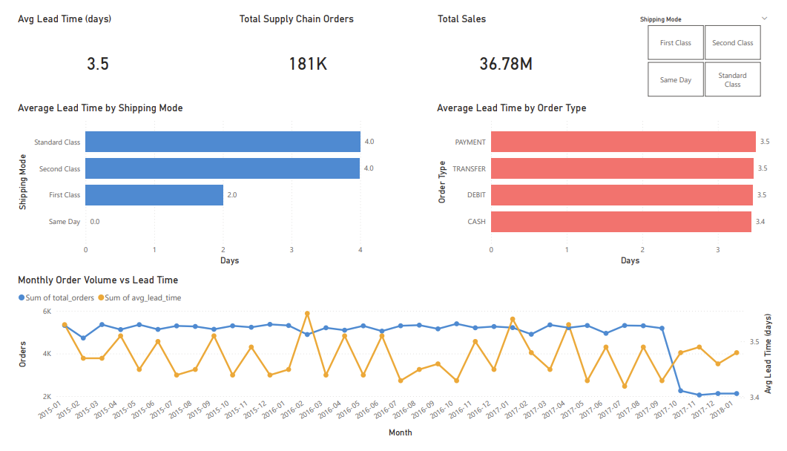

# Warehouse Operations Dashboard

> Built a PowerBI warehouse analytics dashboard using SQL-based data models to visualize productivity, order accuracy, and throughput.

## Dashboard Preview

### Warehouse Operations


### Supply Chain Analysis


## KPIs Tracked

| Metric | Definition | Source |
|--------|-----------|--------|
| Pick Rate | Items picked / hours worked | Simulated |
| Order Accuracy % | % of orders with zero errors | Simulated |
| Dock Utilization % | % of dock capacity in active use | Simulated |
| Labor Productivity | Orders completed / unique workers | Simulated |
| Avg Lead Time | Days from order to shipment | Kaggle DataCo |
| Monthly Order Volume | Total orders per month | Kaggle DataCo |
| Total Sales | Revenue per month | Kaggle DataCo |

## Stack
`Python (Pandas)` · `PostgreSQL` · `Power BI`

## Data Sources
- **Simulated warehouse ops** — generated by `python/generate_data.py`
- **Kaggle DataCo Supply Chain** — https://www.kaggle.com/datasets/shashwatwork/dataco-smart-supply-chain-for-big-data-analysis

## Project Structure
```
warehouse-dashboard/
├── data/                    # Raw and generated CSV files
├── sql/                     # Star schema, seed loader, KPI views
├── python/                  # Data generation and EDA scripts
├── powerbi/                 # Dashboard file and DAX documentation
└── assets/                  # Dashboard screenshots
```

## Setup
```bash
git clone https://github.com/rahulthadhani/warehouse-dashboard
cd warehouse-dashboard
pip install -r requirements.txt
python python/generate_data.py
psql -U postgres -c "CREATE DATABASE warehouse_db;"
psql -U postgres -d warehouse_db -f sql/schema.sql
psql -U postgres -d warehouse_db -f sql/seed.sql
psql -U postgres -d warehouse_db -f sql/views.sql
python python/export_kpis.py
```
